# チュートリアル
### nuleteのインストール
1. Git, Go, Javaをインストールしておく。
2. 以下のコマンドでnuleteをインストールする。
    * `git clone https://github.com/tamadalab/nulete.git`
        * または`git clone git@github.com:tamadalab/nulete.git`
    * `cd nulete`
    * `make install`

### Githubアカウントを取得する
1. [Githubのアカウント作成ページ](https://github.com/join)にアクセスする。
2. ユーザーネームとメールアドレスとパスワードを入力し、「Create account」をクリックする。

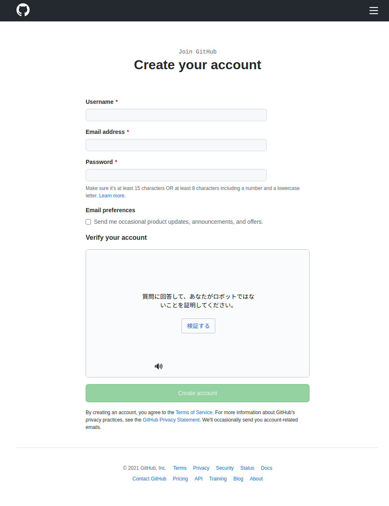

3. メールアドレスに届いたメールから、メールアドレスの確認をする。

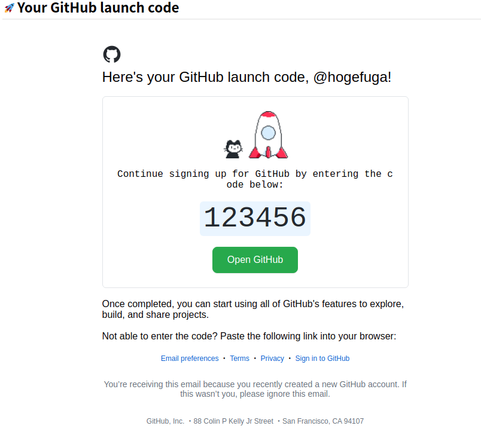
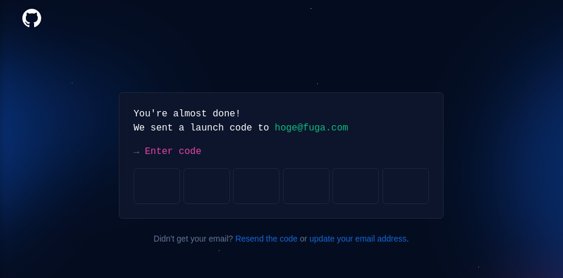

### Github Classroomと連携する
1. [Github Classroomのページ](https://classroom.github.com/)にアクセスし、右上の「Sign in」をクリックしてGithubのアカウントで入る。

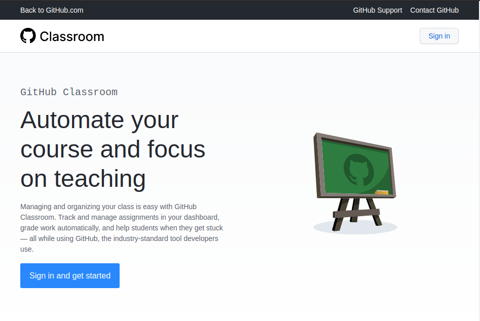

2. 「Authorize Github Classroom」をクリックして連携する。

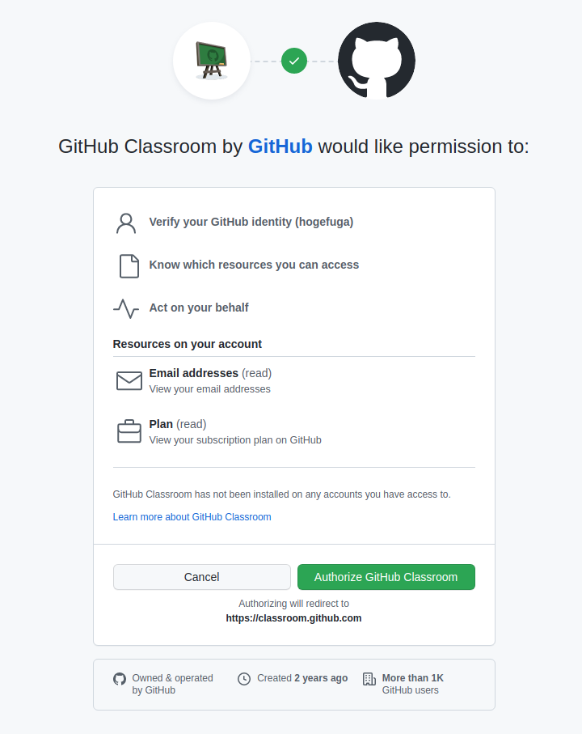

### organizationを作成する
1. Githubのページにアクセスし、右上の「+」から「New organization」をクリックする。

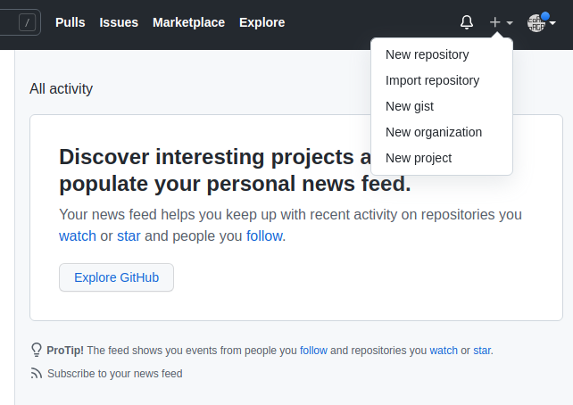

2. 「Create a free organization」をクリックする。

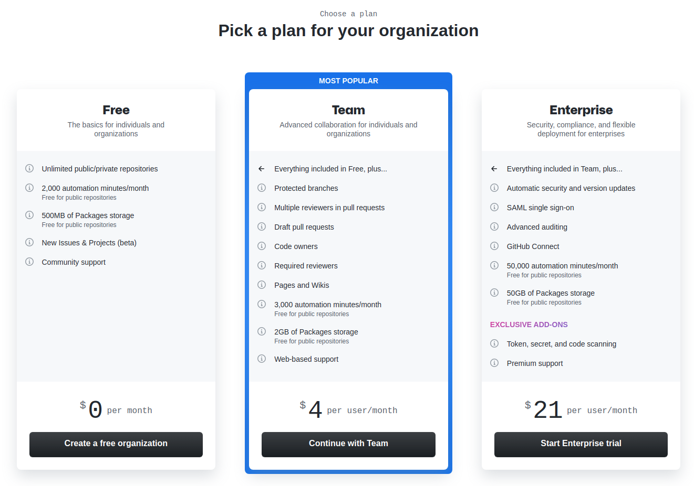

3. アカウントネームとメールアドレスを入力し、所属を選択して、「Next」をクリックする。

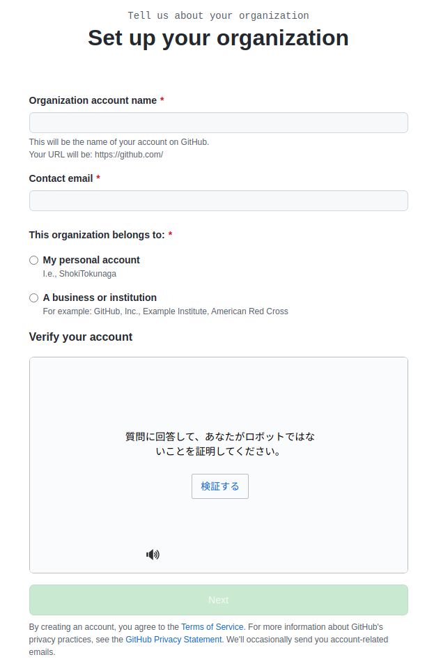

4. 「Complete setup」をクリックする。

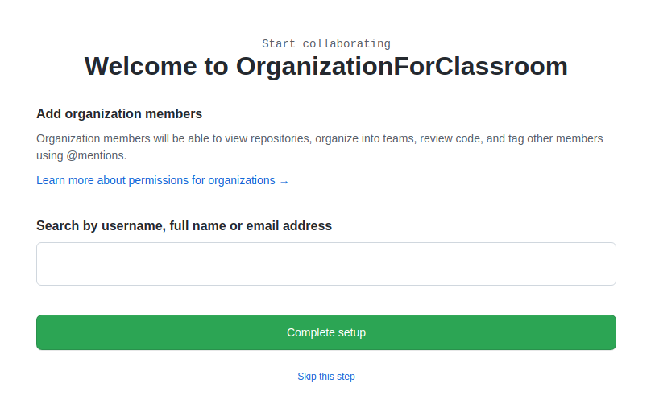

### classroomを作成する
1. [Classroomのページ](https://classroom.github.com/classrooms)で「Create your first classroom」(既にclassroomがある場合は「New classroom」)をクリックする。

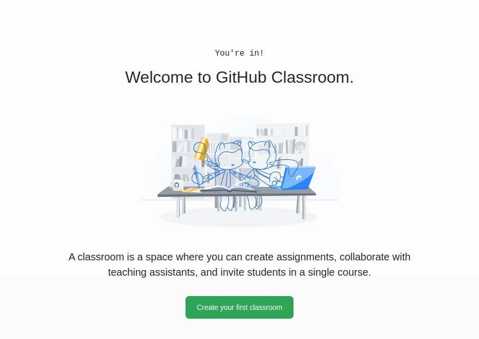
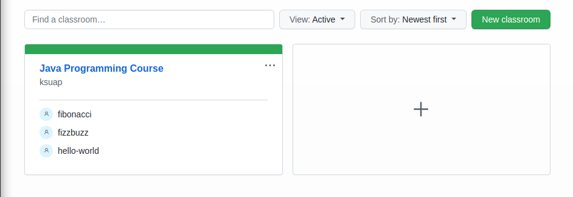

2. organizationを選択する。


3. classroomの名前を入力し、「Create classroom」をクリックする。

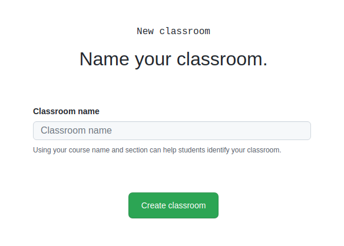

4. 適宜TAの招待や学生の追加をし、「Continue」をクリックする。

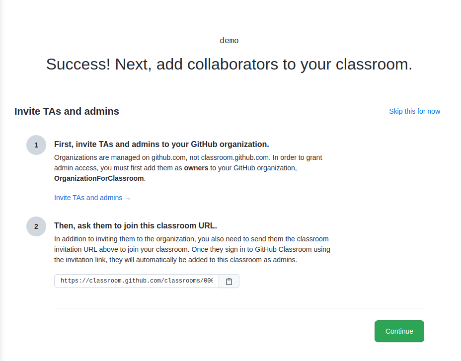
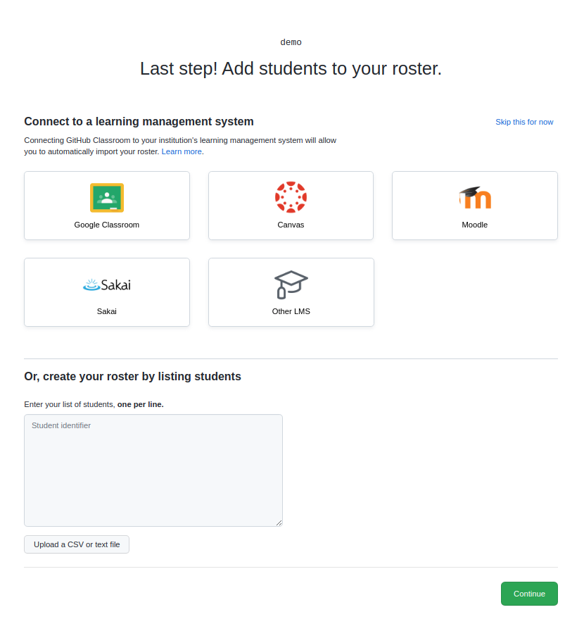

### テンプレートリポジトリを作成する
1. [リポジトリ作成ページ](https://github.com/new)にアクセスする。
2. 「Owner」は作成したorganizationを選択し、「Add a README file」にチェックを入れ、その他リポジトリ名などは適当に入力する。
3. 「Create repository」をクリックする。

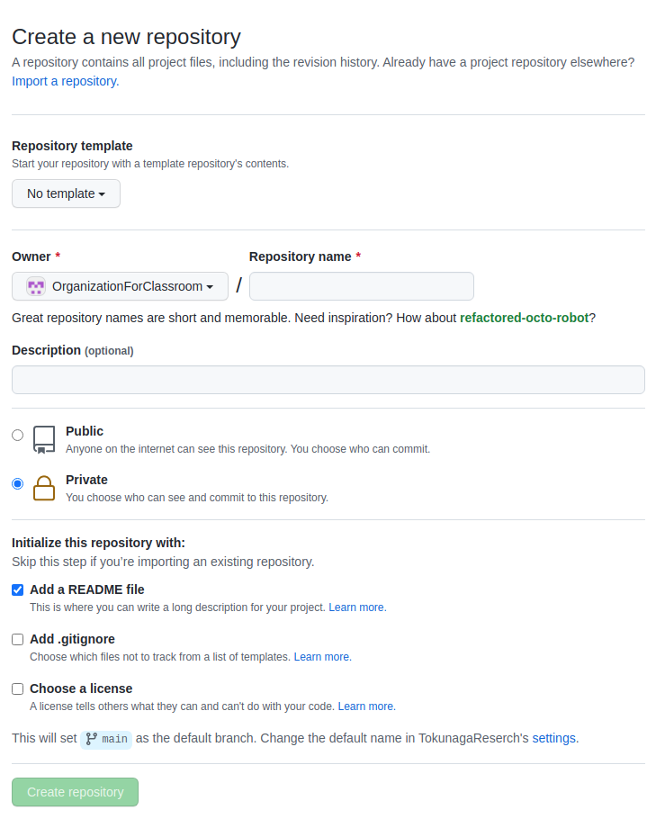

4. リポジトリのページに遷移するので、「Setting」をクリックし、「Template repository」にチェックを入れる。

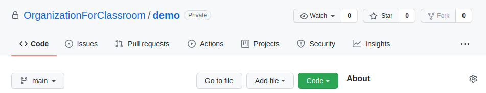


### 模範解答プログラムとテストケースを作成する
1. 模範解答となるJavaのプログラムを作成する。

例 FizzBuzz.java
```java
public class FizzBuzz{
    void run(String[] args){
        Integer to = 15;
        if(args.length != 0){
            to = new Integer(args[0]);
        }

        for(Integer i = 1; i <= to; i++){
            if(i % 3 == 0 && i % 5 == 0){
                System.out.println("FizzBuzz");
            }
            else if(i % 3 == 0){
                System.out.println("Fizz");
            }
            else if(i % 5 == 0){
                System.out.println("Buzz");
            }
            else{
                System.out.println(i);
            }
        }
    }
    public static void main(String[] args){
        FizzBuzz fizzbuzz = new FizzBuzz();
        fizzbuzz.run(args);
    }
}
```

2. テストケースを作成する。
    * Json形式で、メソッドとテスト入力を記述する。
    * ファイル名は模範解答プログラムと同じにする。
    * argsの[]内の要素がメソッドに渡される。
    * メソッドの引数が配列の場合は、更に[]でくくれば良い。

例 FizzBuzz.json
```json
[
    {
        "method": "main",
        "args" : [
            []
        ]
    },
    {
        "method": "main",
        "args" : [
            [
                "3"
            ]
        ]
    },
    {
        "method": "run",
        "args" : [
            [
                "5"
            ]
        ]
    }
]

```

### テストの生成とGithubへのプッシュ
1. 模範解答のプログラムを1つのディレクトリにまとめる。
2. テストケースを1つのディレクトリにまとめる。(模範解答と同じディレクトリでも可)
3. 以下のコマンドでリポジトリをクローンし、テストを生成する。
    1. `git clone https://github.com/<Organization名>/<リポジトリ名>.git`
        * または `git clone git@github.com:<Organization名>/<リポジトリ名>.git`
    2. `cd <リポジトリ名>`
    3. `nulete init`
    4. `nulete gentests --source-dir <模範解答のディレクトリ> --testcase-dir <テストケースのディレクトリ>`
        * テストケースが模範解答と同じディレクトリの場合は`--testcase-dir`は不要である。
4. `src/main/java`の中に模範解答のプログラムがコピーされているので、学生に書いてもらいたい部分を削除する。
5. 以下のコマンドでコミットしてGithubへプッシュする。
    1. `git add --all`
    2. `git commit --all -m "<コミットメッセージ>"`
    3. `git push`

### assignmentを作成する
1. [Classroomのページ](https://classroom.github.com/classrooms)で作成したClassroomをクリックする。

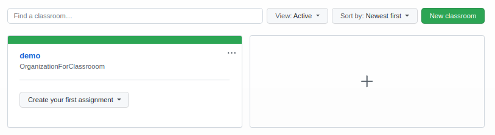

2. 「New assignment」をクリックする。

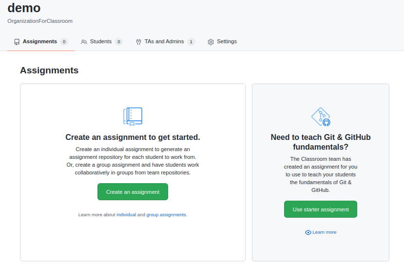

3. assignment名や締切などを設定し、「Continue」をクリックする。

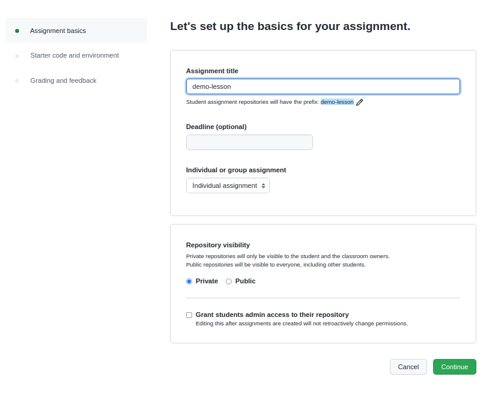

4. 「Select a repository」から、作成したテンプレートリポジトリを選択し、「Continue」をクリックする。

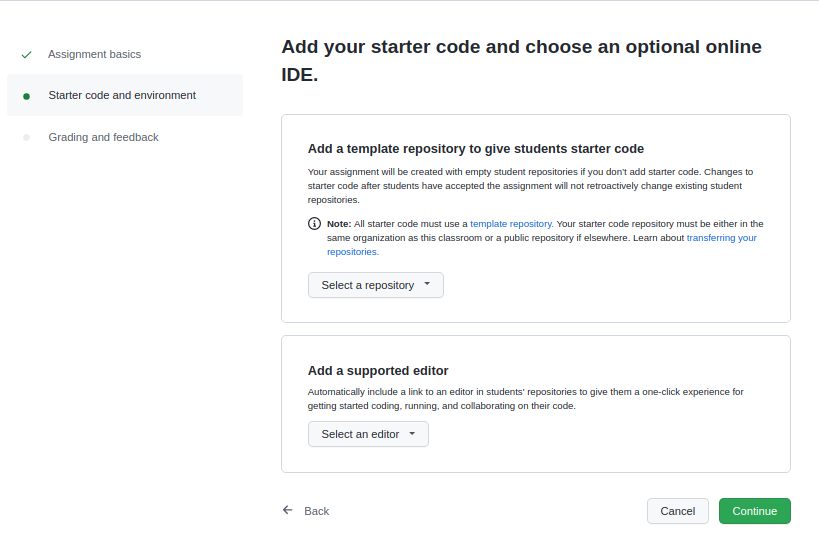

5. 「Enable feedback pull requests」にチェックを入れる。

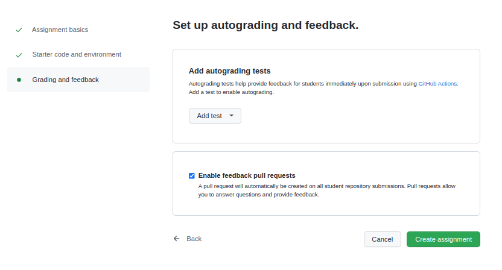

6. 「Add test」をクリックし、「Run Java」を選択する。

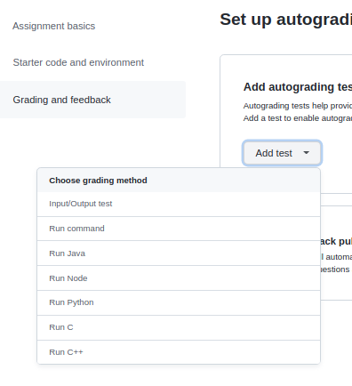

7. テスト名や実行コマンド、配点などを設定し、「save test case」をクリックする。
    * プログラムが複数ある場合は、`gradle test --tests <プログラム名>Test`で各プログラム用のテストを作る。

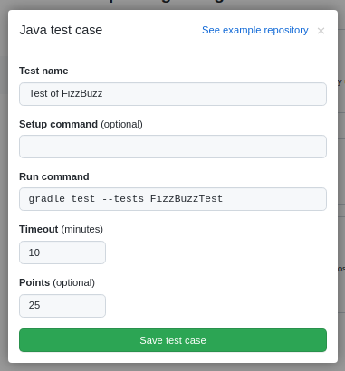

8. 「Create assignment」をクリックする。


### 授業のやり方
1. 招待URLを学生に送る。
2. 学生がアクセスすると、提出用のリポジトリが生成される。
3. 学生は、そのリポジトリをクローンしてプログラムを書き、Githubへプッシュすることで提出する。
4. 教員はassignmentのページから、学生は提出用のリポジトリのプルリクエストから採点結果を確認する。
