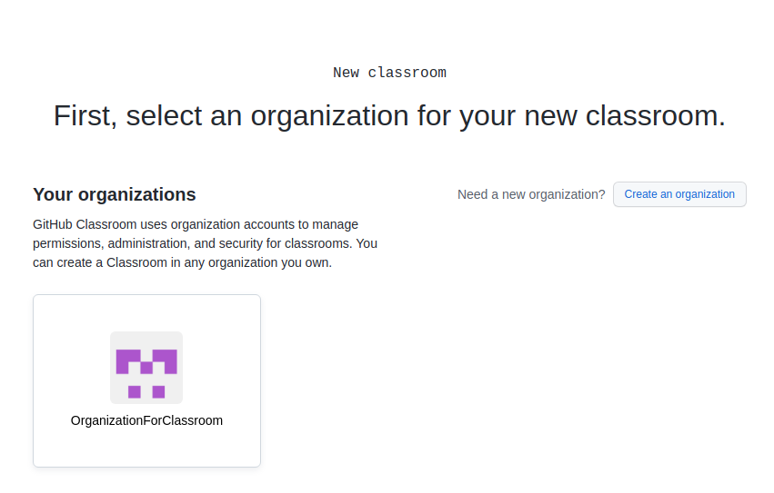
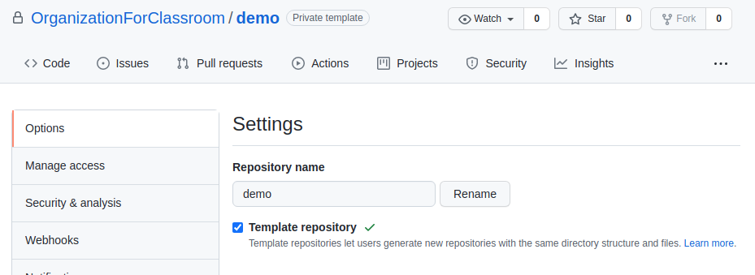

# チュートリアル
### nuleteのインストール
1. Git, Go, Javaをインストールしておく。
2. 以下のコマンドでnuleteをインストールする。
    * `git clone https://github.com/tamadalab/nulete.git`
    * `cd nulete`
    * `make install`

### Githubアカウントを取得する
1. [Githubのアカウント作成ページ](https://github.com/join)にアクセスする。
2. ユーザーネームとメールアドレスとパスワードを入力し、「Create account」をクリックする。

3. メールアドレスに届いたメールから、メールアドレスの確認をする。

### Github Classroomと連携する
1. [Github Classroomのページ](https://classroom.github.com/)にアクセスし、右上の「Sign in」をクリックしてGithubのアカウントで入る。

2. 「Authorize Github Classroom」をクリックして連携する。

### organizationを作成する
1. Githubのページにアクセスし、右上の「+」から「New organization」をクリックする。

2. 「Create a free organization」をクリックする。

3. アカウントネームとメールアドレスを入力し、所属を選択して、「Next」をクリックする。

4. 「Complete setup」をクリックする。

### classroomを作成する
1. [Classroomのページ](https://classroom.github.com/classrooms)で「Create your first classroom」(既にclassroomがある場合は「New classroom」)をクリックする。

2. organizationを選択する。

3. classroomの名前を入力し、「Create classroom」をクリックする。

4. 適宜TAの招待や学生の追加をし、「Continue」をクリックする。

### テンプレートリポジトリを作成する
1. [リポジトリ作成ページ](https://github.com/new)にアクセスする。
2. 「Owner」は作成したorganizationを選択し、「Add a README file」にチェックを入れ、その他リポジトリ名などは適当に入力する。
3. 「Create repository」をクリックする。

4. リポジトリのページに遷移するので、「Setting」をクリックし、「Template repository」にチェックを入れる。

### テストの生成とリポジトリへのプッシュ

### assignmentを作成する

### 授業のやり方
